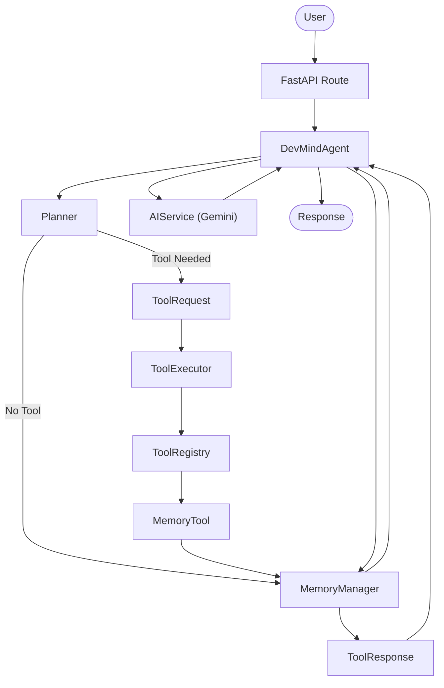
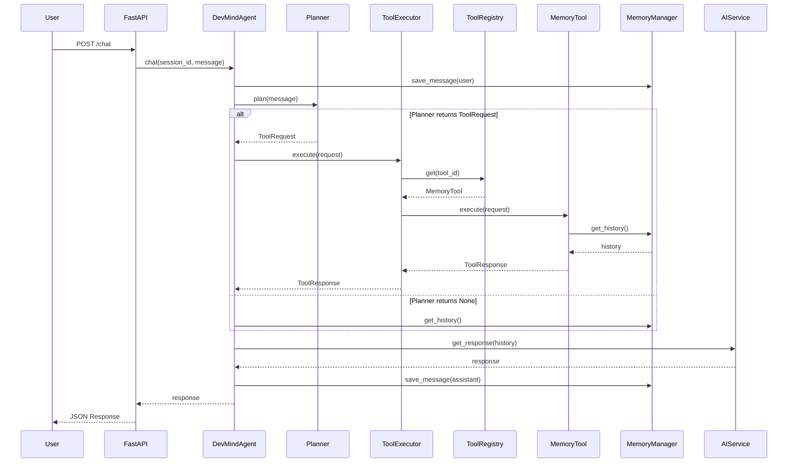
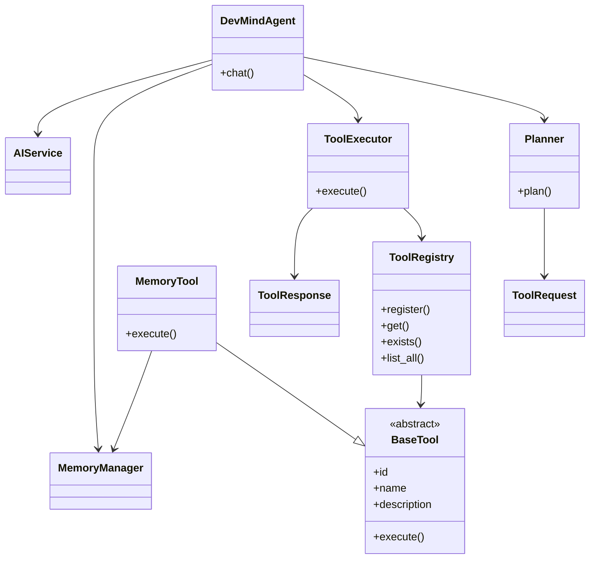
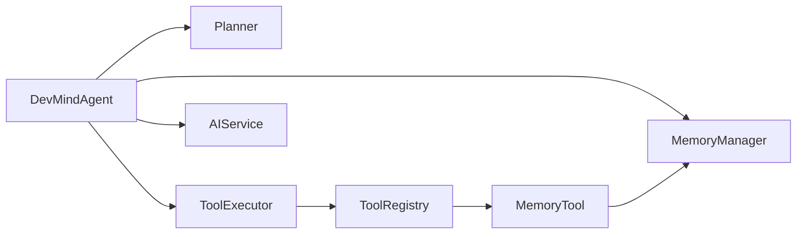

# DevMind AI Architecture

## Overview

DevMind AI follows an **orchestration-based architecture** where the **DevMindAgent** acts as the central coordinator. Instead of embedding all logic inside a single class, responsibilities are delegated to specialized components such as the Planner, Tool Executor, Memory Manager, and AI Service.

This architecture makes the system modular, extensible, and easy to evolve as new capabilities are introduced.

---

# Architecture Evolution

| Version | Milestone |
|----------|-----------|
| v0.1.0 | Agent Architecture |
| v0.2.0 | Memory System |
| **v0.3.0** | **Tool Calling Framework** |
| v0.4.0 *(Planned)* | Intelligent Planner |

---

# Architecture Principles

The project is built around the following design principles:

- Single Responsibility Principle
- Separation of Planning and Execution
- Tool-based Extensibility
- Dependency Injection
- Modular Service Architecture
- Abstract Tool Interface
- Centralized Orchestration

---

# High-Level Architecture



---

# Runtime Sequence

The following sequence illustrates how a typical chat request flows through the system.



---

# Class Relationships



---

# Component Overview



---

# Core Components

## DevMindAgent

The central orchestrator responsible for coordinating every component within the system.

Responsibilities:

- Session management
- Saving conversation history
- Planner execution
- Tool execution
- AI response generation
- Returning API responses

---

## Planner

Responsible for deciding whether a tool should be executed.

Current implementation:

- Keyword-based planning

Future (v0.4):

- LLM-powered planning
- Dynamic tool selection
- Multi-tool execution

---

## ToolExecutor

Executes tool requests generated by the Planner.

Responsibilities:

- Receive ToolRequest
- Find tool
- Execute tool
- Return ToolResponse

---

## ToolRegistry

Maintains every registered tool inside DevMind.

Responsibilities:

- Register tools
- Retrieve tools
- Check existence
- List registered tools

---

## BaseTool

Defines the common interface implemented by every tool.

Every tool must provide:

- id
- name
- description
- execute()

---

## MemoryTool

Acts as an adapter between the Tool Framework and the Memory Manager.

Current operations:

- Retrieve conversation history

Future operations:

- Store notes
- Update notes
- Delete notes
- Clear memory

---

## MemoryManager

Responsible for persistent conversation storage and session management.

Handles:

- Conversation history
- Session creation
- Session deletion
- History retrieval

---

## AIService

Responsible for interacting with Gemini.

Responsibilities:

- Prompt construction
- Context formatting
- AI response generation

---

# Current Request Flow

1. User sends a message through the FastAPI endpoint.
2. DevMindAgent stores the user message.
3. Planner analyzes the request.
4. If required, a ToolRequest is generated.
5. ToolExecutor executes the requested tool.
6. Tool returns a ToolResponse.
7. DevMindAgent prepares conversation history.
8. AIService generates the final response.
9. Assistant response is stored.
10. Response is returned to the user.

---

# Current Tool Framework

```
Planner
      │
      ▼
ToolRequest
      │
      ▼
ToolExecutor
      │
      ▼
ToolRegistry
      │
      ▼
BaseTool
      │
      ▼
MemoryTool
      │
      ▼
MemoryManager
      │
      ▼
ToolResponse
```

---

# Future Roadmap

## v0.4.0

- Intelligent Planner
- LLM-based tool selection
- Multiple tool execution
- Tool confidence scoring

## v0.5.0

- RAG
- Vector Database
- Project Knowledge

## v0.6.0

- Personality System

## v0.7.0

- Repository Intelligence

## v0.8.0

- Plugin Architecture

## v1.0.0

- Stable Release
- Complete AI Developer Assistant

---

# Summary

DevMind AI currently follows a layered architecture where the DevMindAgent orchestrates planning, tool execution, memory management, and AI response generation. The v0.3.0 Tool Calling Framework establishes the foundation for future intelligent capabilities such as repository understanding, retrieval-augmented generation (RAG), plugin support, and autonomous tool selection.